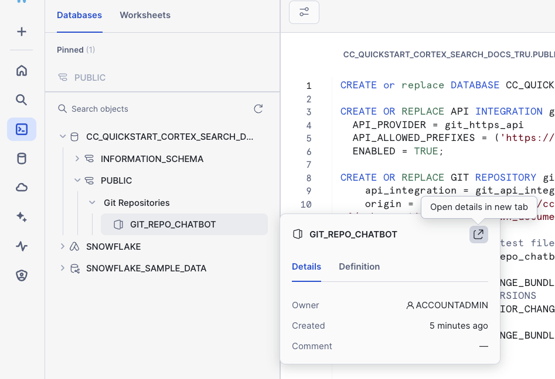
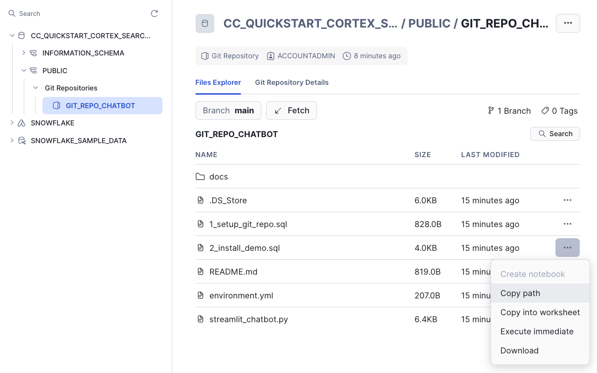
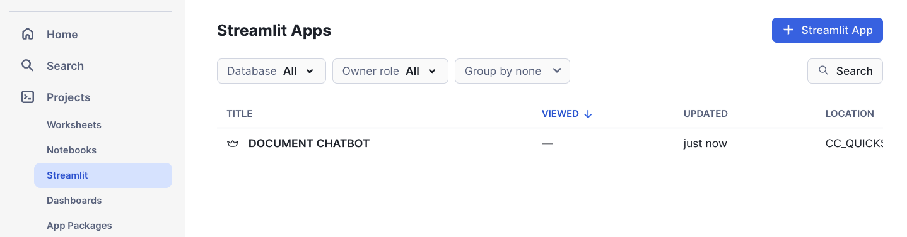
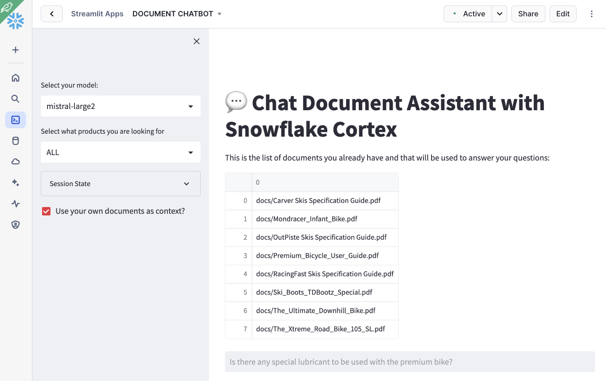
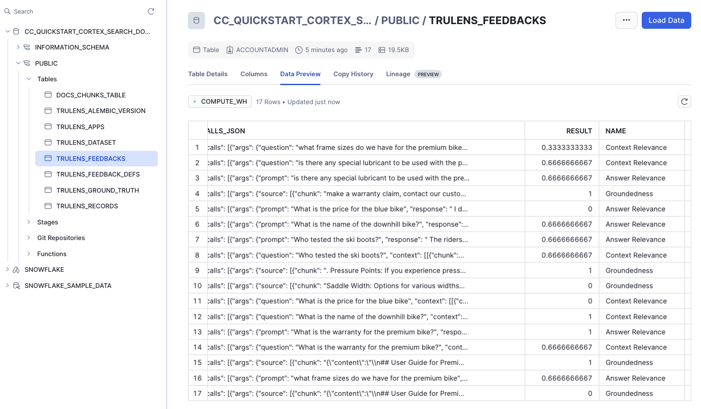
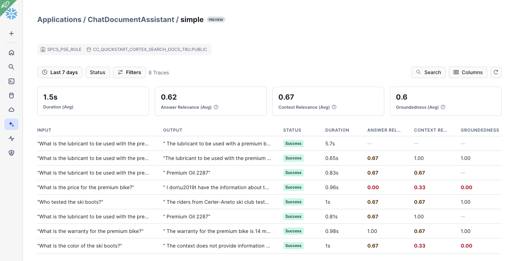

## Build a Retrieval Augmented Generation (RAG) based LLM assistant using Streamlit, Snowflake Cortex Search and ML Observability

This repository is an evolution of the quickstart [Build a Retrieval Augmented Generation (RAG) based LLM assistant using Streamlit and Snowflake Cortex Search](https://quickstarts.snowflake.com/guide/ask_questions_to_your_own_documents_with_snowflake_cortex_search/index.html?index=..%2F..index#0)

This new version includes:
- Git integration: With this all the setup can be done with a single click
- AI Observability: Embeed the code in an App class where Observability is added so we can see how the RAG App is performing

### Setup

#### 1. Setup Git Repo:

Follow these steps: 

- Click on Projects -> Worksheets
- At the top rigth, click on + to add a new worksheet
- Copy/paste the code from [1_setup_git_repol.sql](https://github.com/ccarrero-sf/ask_questions_to_your_own_documents_with_snowflake_cortex_search_and_trulens/blob/main/1_setup_git_repo.sql)

That code will:
- Create a new database
- Create an API inegration
- Create a GIT reposotiry with this one
- Will fetch the data

After running that setup, you should be able to see the git repo. Open the details in a new tab:

#### 2. Complete Setup

The difference with the first guide, is that using Git integration, we are configuring everything we need, including the Streamlit App. 

Under GIT_REPO_CHATBOT, select <b>2_install_demo.sql</b> and either "Copy into worksheet" or "Execute immediate". 

This will:

- Create an staging area to hold PDF documents
- Copy PDF documents from the Git repository into the staging area
- Create some helper functions
- Create a table to hold PDF chunks
- Process PDF documents
- Classify PDF documents using LLMs
- Create Cortex Search Service that will be used by the RAG App to find relevant context
- Create a Streamlit App from the code in the Git repository

The [Streamlit App](https://github.com/ccarrero-sf/ask_questions_to_your_own_documents_with_snowflake_cortex_search_and_trulens/blob/main/streamlit_chatbot.py) uses Trulens to provide observability for:

- Context relevance
- Answer relevance
- Groundedness

Under Projects -> Streamlit you should have access now to the DOCUMENT CHATBOT App:

And you should be able to run the App, where you can start asking questions about your documents and compare results when using or not the documents as context:

As you use the app, in the private preview, you can see how evaluation data is stored within Snowflake in some TRULENS tables:

You can also reach out to your Snowflake Account team in order to enable the Applications page under AI/ML within Snowsight so you can track your App performance:

NOTE: This is based in a Private Preview version. Things will be different once in Public Preview so this guide will be updated.

