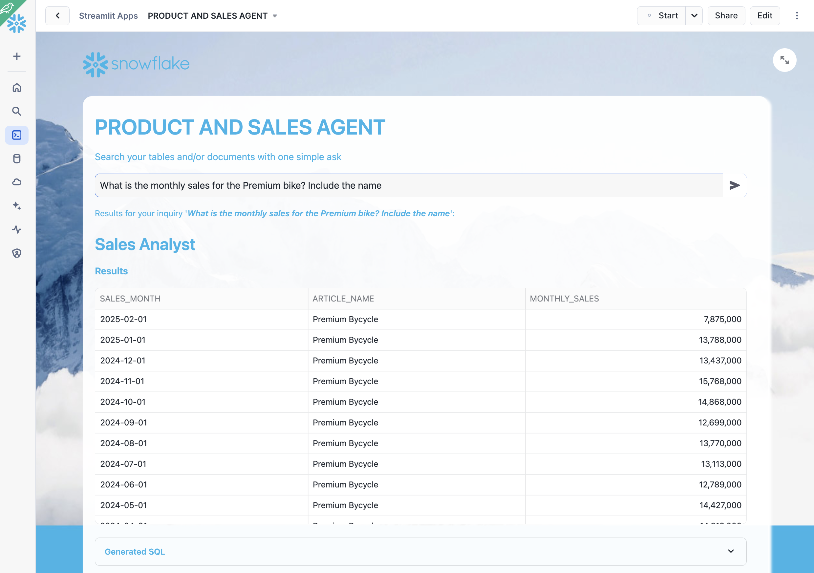
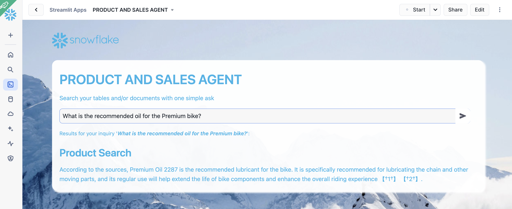

## Build an Support Assistant Chatbot Leveraging PDF Docs and Sales Data using Cortex Agents

This repository is an evolution of the quickstart [Build a Retrieval Augmented Generation (RAG) based LLM assistant using Streamlit and Snowflake Cortex Search](https://quickstarts.snowflake.com/guide/ask_questions_to_your_own_documents_with_snowflake_cortex_search/index.html?index=..%2F..index#0). It includes AI Observability for the Search App and also creates a new Agent App that is able to search both unstructured data (PDF documents about bikes and snow gear) and structured data (sales data about those articles).

Big thanks to Jeff Carpenter for providing the Agent App within SIS.

This new version includes:
- Git integration: With this all the setup can be done with a single click
- AI Observability: Embeed the code in an App class where Observability is added so we can see how the RAG App is performing
- Create structured data about product sales
- Create the Agent App that leverages Cortex Agents

### Setup

#### 1. Setup Git Repo:

Follow these steps: 

- Click on Projects -> Worksheets
- At the top rigth, click on + to add a new worksheet
- Copy/paste the code from [1_setup_git_repol.sql](https://github.com/ccarrero-sf/cortex_agents_chatbot_bikes/blob/main/1_setup_git_repo.sql)

That code will:
- Create a new database
- Create an API inegration
- Create a GIT reposotiry with this one
- Will fetch the data

After running that setup, you should be able to see the git repo. Open the details in a new tab:

#### 2. Complete Setup

The difference with the first guide, is that using Git integration, we are configuring everything we need, including the Streamlit App. 

Under GIT_REPO_CHATBOT, select <b>2_install_demo.sql</b> and either "Copy into worksheet" or "Execute immediate". 

This will:

- Create an staging area to hold PDF documents
- Copy PDF documents from the Git repository into the staging area
- Create some helper functions
- Create a table to hold PDF chunks
- Process PDF documents
- Classify PDF documents using LLMs
- Create Cortex Search Service that will be used by the RAG App to find relevant context
- Create a Streamlit App from the code in the Git repository to demo how RAG works
- Create sales tables and fill with data
- Enable Cortex Search in article table to help searching on structured data
- Install the Agent App that leverages Cortex Agents

#### 3. Search RAG App

The [Streamlit RAG App](https://github.com/ccarrero-sf/cortex_agents_chatbot_bikes/blob/main/streamlit_chatbot.py) uses Trulens to provide observability for:

- Context relevance
- Answer relevance
- Groundedness

Under Projects -> Streamlit you should have access now to the DOCUMENT CHATBOT App:

And you should be able to run the App, where you can start asking questions about your documents and compare results when using or not the documents as context:

As you use the app, in the private preview, you can see how evaluation data is stored within Snowflake in some TRULENS tables:

You can also reach out to your Snowflake Account team in order to enable the Applications page under AI/ML within Snowsight so you can track your App performance:

Questions you can ask that are unique for those documents:
- Is there any special lubricant to be used with the premium bike?
- Does the mondracer infant bike need any special tool?
- Is there any temperature to be considered with the premium bicycle?
- What is the temperature to store the ski boots?
- Where have the ski boots been tested and who tested them?
- What is the price for the premiun bike

NOTE: This is based in a Private Preview version. Things will be different once in Public Preview so this guide will be updated.

#### 4. Use the Support Assistant Chatbot that leverages Cortex Agents

In the Streamlit tab, click on PRODUCT AND SALES AGENT

You can ask questions where the anser will need an analytical response (SQL). Example

- What is the monthly sales for the Premium bike? Include the name

Or you can ask a question where the answer will be in the PDF documents:

- What is the recommended oil for the Premium bike?

